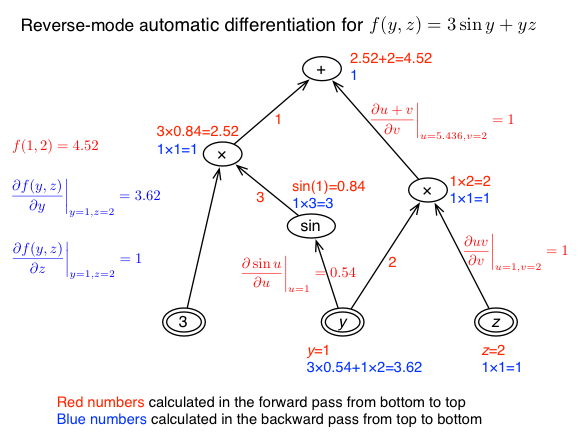
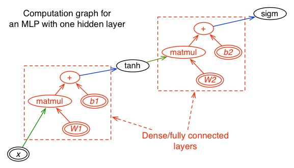
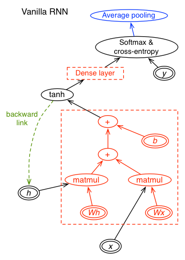
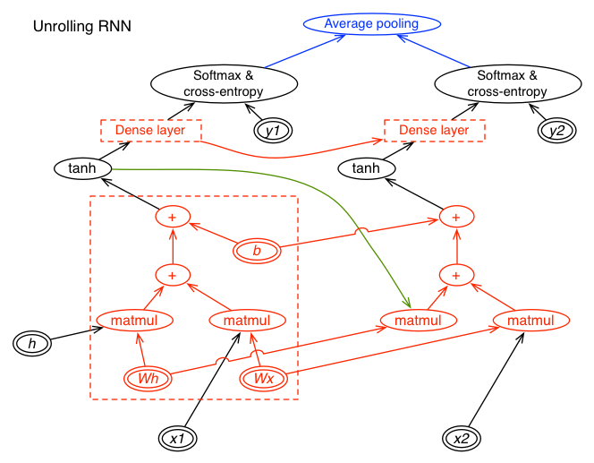

## Preface 

This document explains how KANN is implemented and some philosophies behind the
design. Importantly, the methods described here are only one way to implement
a deep learning framework from scratch. They are not necessarily the optimal
way. Please take the words below with a grain of salt.


## Table of Contents

* [Basic Concepts](#basic-concepts)
  - [N-dimensional array](#n-dimensional-array)
  - [Automatic differentiation and computational graph](#automatic-differentiation-and-computational-graph)
  - [Backpropagating matrix products](#backpropagating-matrix-products)
  - [Network layers](#network-layers)
  - [Conventions on the shapes of n-d arrays](#conventions-on-the-shapes-of-n-d-arrays)
* [Implementing Recurrent Neural Network (RNN)](#implementing-recurrent-neural-network-rnn)
  - [Computational graph of RNN](#computational-graph-of-rnn)
  - [Unrolling RNN](#unrolling-rnn)


## Basic Concepts

### N-dimensional array

N-dimensional array, or n-d array in brief, is a fundamental object that holds
most types of numerical data in KANN. It can be described with the following
struct:
```cpp
typedef struct {
    int n_d;   // number of dimensions
    int *d;    // dimensions, of size n_d
    float *x;  // array data, of size \prod_i{d[i]} (1 if n_d==0)
} NDArray_t;
```
The dimensions are also called the *shape* of the array. Conventionally, we
call the n-d array a scalar if *n\_d* equals 0, a vector if *n\_d* equals 1 and
a matrix if *n\_d* equals 2. As a side note, deep learning frameworks often
take n-d array as a synonym of *tensor*, though according to
[wiki][tensor-wiki], this seems imprecise.

### Automatic differentiation and computational graph

[Automatic differentiation][ad] is the backbone of several major deep learning
frameworks. It efficiently computes the gradient of a function without symbolic
derivation. Automatic differentiation is typically achieved with a graph which
is loosely called as a computational graph or a data flow graph (as in
TensorFlow). Detailed description of automatic differentiation is beyond the
scope of this note. We will only show an example here:



A generic computational graph only distinguishes differentiable variables and
non-differentiable parameters or constants. It does not have a concept of
input, truth output, cost, hyperparameter and so on. KANN gives a node a
specific meaning by putting one label on the node. A KANN model is a labeled
computational graph.

The example here demonstrates the so-called symbol-to-number differentiation.
[TensorFlow][tf] and [Theano][theano] use symbol-to-symbol differentiation
by augmenting the computational graph with derivative nodes. We refer to the
[Deep Learning book][dlbook] for details.

### Backpropagating matrix products

In implementation, each node in a computational graph holds an n-d array. An
important operation between two 2D arrays is [matrix product][matmul]. If we
let the shape of the gradient take the same shape as the variable, we can
backpropagate gradients with:
<!--
{\bf C}={\bf A}\cdot{\bf B},
\hspace{1em}\frac{\partial F}{\partial {\bf A}}\gets\frac{\partial F}{\partial {\bf C}}\cdot {\bf B}^\intercal,
\hspace{1em}\frac{\partial F}{\partial {\bf B}}\gets{\bf A}^\intercal\cdot\frac{\partial F}{\partial {\bf C}}
-->


As we see here, gradients update also involes matrix product and thus can be
calculated with the GEMM routine from [BLAS][blas]. KANN more often uses matrix
product with the second matrix transposed (see
[below](#conventions-on-the-shapes-of-n-d-arrays)). The backprop rule becomes:
<!--
{\bf Y}={\bf X}\cdot{\bf W}^\intercal,
\hspace{1em}\frac{\partial F}{\partial {\bf X}}\gets\frac{\partial F}{\partial {\bf Y}}\cdot {\bf W},
\hspace{1em}\frac{\partial F}{\partial {\bf W}}\gets\left(\frac{\partial F}{\partial {\bf Y}}\right)^\intercal\cdot{\bf X}
-->


### Network layers

In the context of computational graph, a layer is a well-defined reusable
subgraph. The following figure shows the computational graph of a [multilayer
perceptron][mlp] with one hidden layer:



In this figure, each dotted red box represents a dense (aka fully connected)
layer that has one input (in green) and one output (in blue). In KANN, a layer
works exactly this way. Layer subgraphs are defined by the `kann_layer_*()`
functions in [kann.*](../kann.h).

### Conventions on the shapes of n-d arrays

In KANN and many other deep learning libraries, the first dimension of input
nodes, output nodes and most internal nodes is the size of a mini-batch. 
Weight matrices have the number of output values as the first dimension and the
number of input values as the second dimension. Due to such shapes, we are
unable to compute the standard matrix product of weight *W* and input *x* due
to dimension mismatch. We do not know how other libraries resolve this issue.
In KANN, we have a cmul(*x*,*W*) operator instead which computes
mul(*x*,T(*W*)), where T() is matrix transpose and mul() the standard matrix
product. The first dimension of cmul(*x*,*W*) is the same as *x*.

For 2D convolution, most libraries use the (batch-size,in-channel,height,width)
shape (aka the NCHW shape) for input as default and the
(out-channel,in-channel,kernel-height,kernel-width) shape for weight matrices.
KANN follows the same convention.


## Implementing Recurrent Neural Network (RNN)

There are usually two ways to implement an RNN. First, we may unroll the RNN to
a feed-forward network (FNN) and then apply the same FNN algorithm for
training. Second, we may keep the history of values and derivatives at each
node without unrolling and then traverse the history backwardly to calculate
the gradients. KANN takes the first approach for training as we thought this
might be easier to implement. Many other deep learning libraries take the
second or both approaches. For prediction, as we do not need to keep the
history of computation, both approaches are equally easy to implement in KANN.

### Computational graph of RNN

The following figure shows the computational graph of a vanilla RNN where
"Dense layer" is a red dotted box in the [MLP figure](images/mlp.png).



This graph differs from typical feedforward graphs in two aspects: the presence
of the backward link (in green) and a pooling node (in blue). The backward link
indicates where is recurrence. In the source code, the `kad_node_t::pre`
pointer in [kautodiff.h](../kautodiff.h) implements such a link. The pooling
node specifies where data at different time steps should be pooled together.
The figure above pools the cost at each step. It is typically used when the
output is also a sequence (e.g. for text generation). Another typical use case
is to put the pooling node right above the "Dense layer". In this case, the
network output is not a sequence. We may use such a network, for example, to
classify music.

Computational graphs of LSTM and GRU networks are similar, except that the red
dotted box becomes more complex.

### Unrolling RNN

The following figure shows an FNN by unrolling the RNN twice:



The green edge represents the backward link in the previous figure. This FNN
takes (*x1*,*x2*) as input and (*y1*,*y2*) as truth output.

Generally, to unroll an RNN to a certain length, we first duplicate internal
nodes and input/output nodes "below" the (possibly multiple) pooling nodes and
connect different time steps following the backward links. As other external
nodes are not duplicated, we also need to adjust the children of some
duplicated nodes.  We then pool the duplicated descendents of the pooling nodes
and finally copy over the nodes "above" the pooling nodes. Another way to
understand the unrolling algorithm is to simulate forward data flows in the
original RNN graph.  We add a node to the unrolled graph when the data flow
visits the node; we add a pooling node when all its duplicated descendants have
been computed; we copy over the rest of nodes when all pooling nodes have been
computed.


[tensor-wiki]: https://en.wikipedia.org/wiki/Tensor
[tf]: https://www.tensorflow.org
[theano]: http://deeplearning.net/software/theano/
[ad]: https://en.wikipedia.org/wiki/Automatic_differentiation
[mlp]: https://en.wikipedia.org/wiki/Multilayer_perceptron
[rnnjs]: https://github.com/karpathy/recurrentjs
[matmul]: https://en.wikipedia.org/wiki/Matrix_multiplication
[blas]: https://en.wikipedia.org/wiki/Basic_Linear_Algebra_Subprograms
[dlbook]: http://www.deeplearningbook.org
